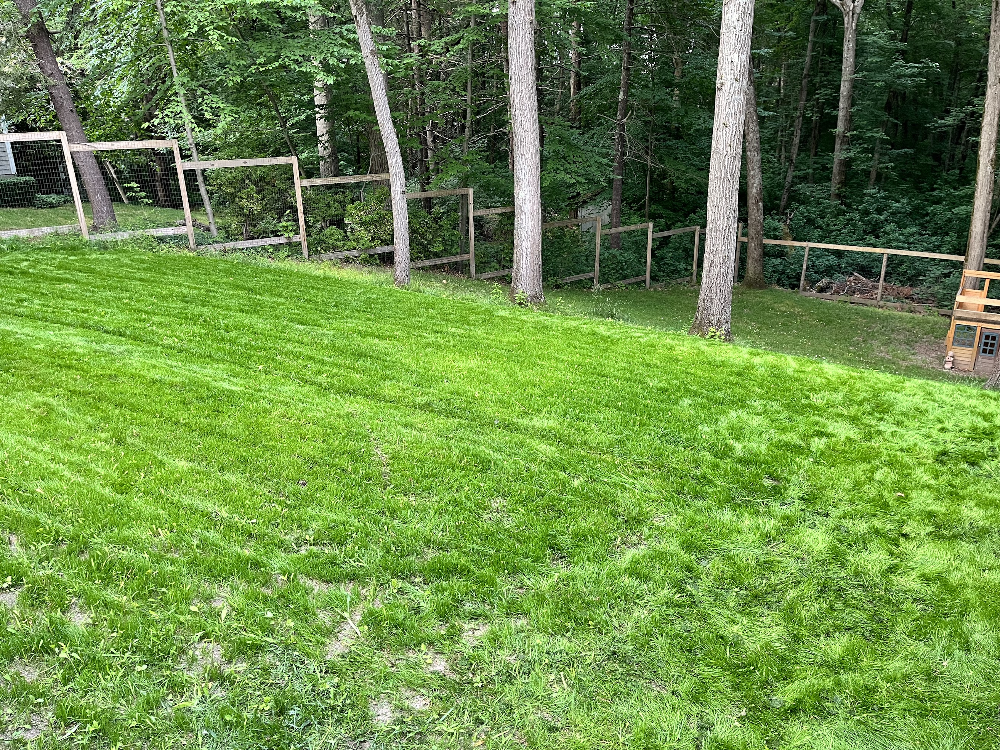
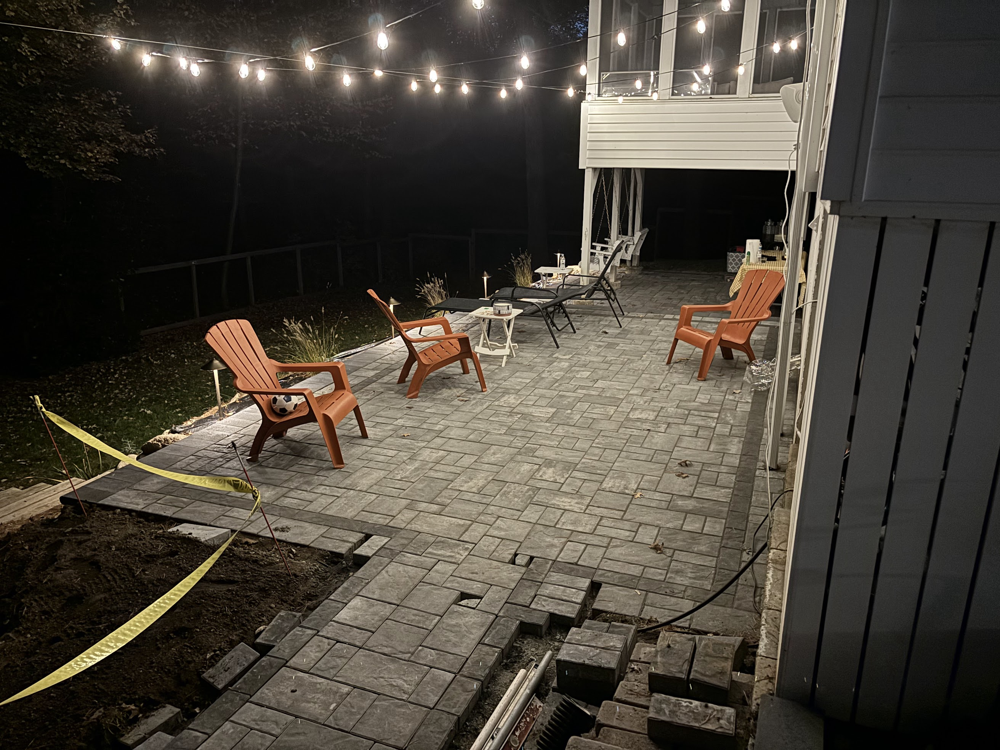

---
# Feel free to add content and custom Front Matter to this file.
# To modify the layout, see https://jekyllrb.com/docs/themes/#overriding-theme-defaults

layout: default
---

<!-- Hero Section -->
<header class="relative bg-cover bg-center bg-[url('assets/photos/landscaping/lawn-5.jpeg')] text-white h-80 md:h-[40rem] flex flex-col justify-center items-center px-10">
  

  

    <h1 class="text-5xl font-bold mb-4">Landscaping, Masonry, Snow Removal</h1>
    
Elevate, Transform, Defend: Your All-Season Partner for Landscaping, Masonry, and Snow Removal.

    <a href="#services" class="bg-white text-green-600 px-6 py-3 rounded-full font-semibold transition duration-300 hover:bg-green-600 hover:text-white">Explore Services</a>
  

</header>

<!-- Services Section -->
<section id="services" class="container mx-auto my-12 px-2">
  <h2 class="text-3xl font-semibold mb-6">Our Services</h2>
  

    <!-- Service Card 1 -->
    

      <h3 class="text-xl font-semibold mb-4">Lawn Care</h3>
      

        <ul class="grid grid-cols-1 md:grid-cols-2">
          <li class="flex gap-2"><svg class="h-6 w-5 flex-none text-emerald-600" viewBox="0 0 20 20" fill="currentColor" aria-hidden="true">
            <path fill-rule="evenodd" d="M16.704 4.153a.75.75 0 01.143 1.052l-8 10.5a.75.75 0 01-1.127.075l-4.5-4.5a.75.75 0 011.06-1.06l3.894 3.893 7.48-9.817a.75.75 0 011.05-.143z" clip-rule="evenodd" />
          </svg>Mowing</li>
          <li class="flex gap-2"><svg class="h-6 w-5 flex-none text-emerald-600" viewBox="0 0 20 20" fill="currentColor" aria-hidden="true">
            <path fill-rule="evenodd" d="M16.704 4.153a.75.75 0 01.143 1.052l-8 10.5a.75.75 0 01-1.127.075l-4.5-4.5a.75.75 0 011.06-1.06l3.894 3.893 7.48-9.817a.75.75 0 011.05-.143z" clip-rule="evenodd" />
          </svg>Lawn treatment</li>
          <li class="flex gap-2"><svg class="h-6 w-5 flex-none text-emerald-600" viewBox="0 0 20 20" fill="currentColor" aria-hidden="true">
            <path fill-rule="evenodd" d="M16.704 4.153a.75.75 0 01.143 1.052l-8 10.5a.75.75 0 01-1.127.075l-4.5-4.5a.75.75 0 011.06-1.06l3.894 3.893 7.48-9.817a.75.75 0 011.05-.143z" clip-rule="evenodd" />
          </svg>Pruning</li>
          <li class="flex gap-2"><svg class="h-6 w-5 flex-none text-emerald-600" viewBox="0 0 20 20" fill="currentColor" aria-hidden="true">
            <path fill-rule="evenodd" d="M16.704 4.153a.75.75 0 01.143 1.052l-8 10.5a.75.75 0 01-1.127.075l-4.5-4.5a.75.75 0 011.06-1.06l3.894 3.893 7.48-9.817a.75.75 0 011.05-.143z" clip-rule="evenodd" />
          </svg>Fall clean up</li>
        </ul>
      

      
      <a class="block text-lg mt-6 text-right hover:underline" href="landscaping.html">Learn More →</a>
    

    <!-- Service Card 2 -->
    

      <h3 class="text-xl font-semibold mb-4">Masonry</h3>
      

        <ul class="grid grid-cols-1 md:grid-cols-2">
          <li class="flex gap-2"><svg class="h-6 w-5 flex-none text-emerald-600" viewBox="0 0 20 20" fill="currentColor" aria-hidden="true">
            <path fill-rule="evenodd" d="M16.704 4.153a.75.75 0 01.143 1.052l-8 10.5a.75.75 0 01-1.127.075l-4.5-4.5a.75.75 0 011.06-1.06l3.894 3.893 7.48-9.817a.75.75 0 011.05-.143z" clip-rule="evenodd" />
          </svg>Hardscaping</li>
          <li class="flex gap-2"><svg class="h-6 w-5 flex-none text-emerald-600" viewBox="0 0 20 20" fill="currentColor" aria-hidden="true">
            <path fill-rule="evenodd" d="M16.704 4.153a.75.75 0 01.143 1.052l-8 10.5a.75.75 0 01-1.127.075l-4.5-4.5a.75.75 0 011.06-1.06l3.894 3.893 7.48-9.817a.75.75 0 011.05-.143z" clip-rule="evenodd" />
          </svg>Patios</li>
          <li class="flex gap-2"><svg class="h-6 w-5 flex-none text-emerald-600" viewBox="0 0 20 20" fill="currentColor" aria-hidden="true">
            <path fill-rule="evenodd" d="M16.704 4.153a.75.75 0 01.143 1.052l-8 10.5a.75.75 0 01-1.127.075l-4.5-4.5a.75.75 0 011.06-1.06l3.894 3.893 7.48-9.817a.75.75 0 011.05-.143z" clip-rule="evenodd" />
          </svg>Retaining walls</li>
          <li class="flex gap-2"><svg class="h-6 w-5 flex-none text-emerald-600" viewBox="0 0 20 20" fill="currentColor" aria-hidden="true">
            <path fill-rule="evenodd" d="M16.704 4.153a.75.75 0 01.143 1.052l-8 10.5a.75.75 0 01-1.127.075l-4.5-4.5a.75.75 0 011.06-1.06l3.894 3.893 7.48-9.817a.75.75 0 011.05-.143z" clip-rule="evenodd" />
          </svg>Chimneys</li>
        </ul>
      

      
      <a class="block text-lg mt-6 text-right hover:underline" href="masonry.html">Learn More →</a>
    

    <!-- Service Card 3 -->
    

      <h3 class="text-xl font-semibold mb-4">Snow Removal</h3>
      

        <ul class="grid grid-cols-1 md:grid-cols-2">
          <li class="flex gap-2"><svg class="h-6 w-5 flex-none text-emerald-600" viewBox="0 0 20 20" fill="currentColor" aria-hidden="true">
            <path fill-rule="evenodd" d="M16.704 4.153a.75.75 0 01.143 1.052l-8 10.5a.75.75 0 01-1.127.075l-4.5-4.5a.75.75 0 011.06-1.06l3.894 3.893 7.48-9.817a.75.75 0 011.05-.143z" clip-rule="evenodd" />
          </svg>Plowing</li>
          <li class="flex gap-2"><svg class="h-6 w-5 flex-none text-emerald-600" viewBox="0 0 20 20" fill="currentColor" aria-hidden="true">
            <path fill-rule="evenodd" d="M16.704 4.153a.75.75 0 01.143 1.052l-8 10.5a.75.75 0 01-1.127.075l-4.5-4.5a.75.75 0 011.06-1.06l3.894 3.893 7.48-9.817a.75.75 0 011.05-.143z" clip-rule="evenodd" />
          </svg>Shoveling</li>
          <li class="flex gap-2"><svg class="h-6 w-5 flex-none text-emerald-600" viewBox="0 0 20 20" fill="currentColor" aria-hidden="true">
            <path fill-rule="evenodd" d="M16.704 4.153a.75.75 0 01.143 1.052l-8 10.5a.75.75 0 01-1.127.075l-4.5-4.5a.75.75 0 011.06-1.06l3.894 3.893 7.48-9.817a.75.75 0 011.05-.143z" clip-rule="evenodd" />
          </svg>Salting</li>
          <li class="flex gap-2"><svg class="h-6 w-5 flex-none text-emerald-600" viewBox="0 0 20 20" fill="currentColor" aria-hidden="true">
            <path fill-rule="evenodd" d="M16.704 4.153a.75.75 0 01.143 1.052l-8 10.5a.75.75 0 01-1.127.075l-4.5-4.5a.75.75 0 011.06-1.06l3.894 3.893 7.48-9.817a.75.75 0 011.05-.143z" clip-rule="evenodd" />
          </svg>Sanding</li>
        </ul>
      

      
      <a class="block text-lg mt-6 text-right hover:underline" href="snow-removal.html">Learn More →</a>
    

  

</section>

