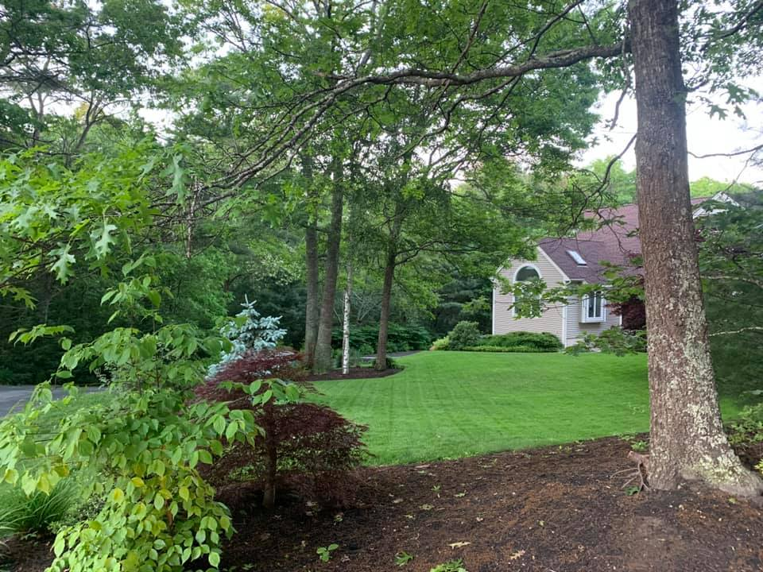
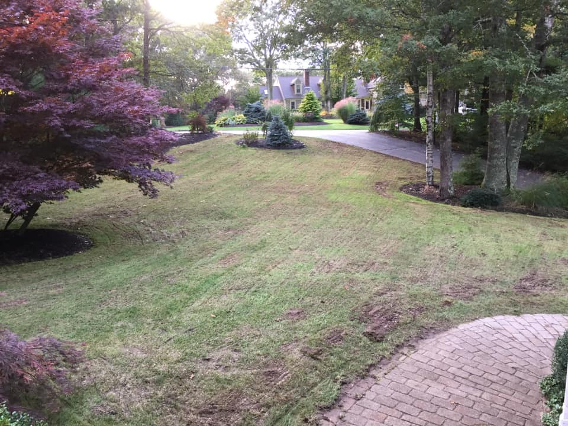
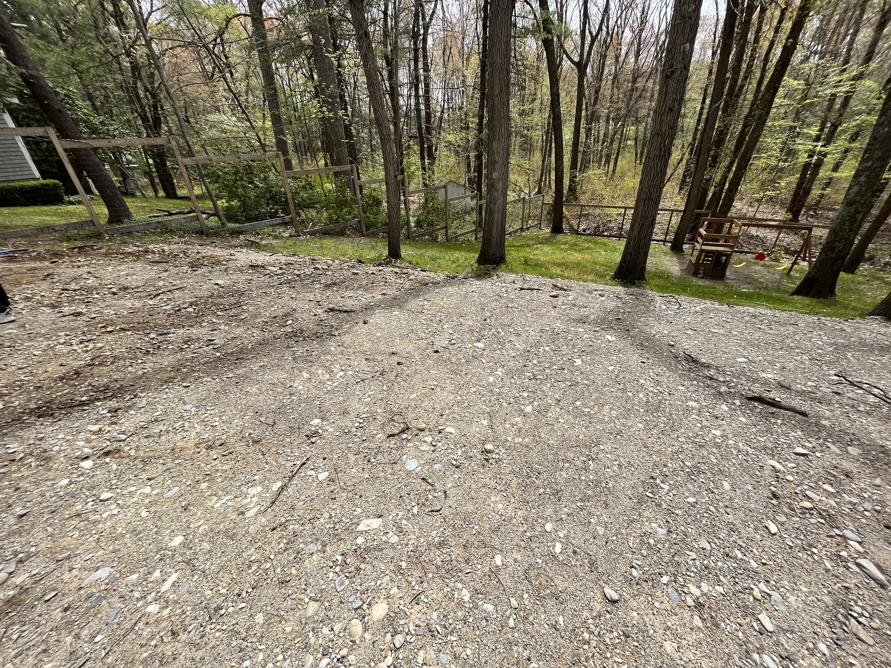

  

    

      <h1 class="text-2xl font-bold tracking-tight text-gray-900">Landscaping & Lawn Care</h1>
      
Transform your outdoor space with our comprehensive lawn care services, tailored to meet the unique needs of your lawn. From precision mowing and fertilization to weed control and seasonal cleanups, we ensure a lush, vibrant lawn that becomes the envy of the neighborhood.

      

        <h4 class="flex-none text-sm font-semibold leading-6 text-emerald-600">Offered services</h4>
        

      

      <ul role="list" class="mt-8 grid grid-cols-1 gap-4 text-sm leading-6 text-gray-600 sm:grid-cols-2 sm:gap-6">
        <li class="flex gap-x-3">
          <svg class="h-6 w-5 flex-none text-emerald-600" viewBox="0 0 20 20" fill="currentColor" aria-hidden="true">
            <path fill-rule="evenodd" d="M16.704 4.153a.75.75 0 01.143 1.052l-8 10.5a.75.75 0 01-1.127.075l-4.5-4.5a.75.75 0 011.06-1.06l3.894 3.893 7.48-9.817a.75.75 0 011.05-.143z" clip-rule="evenodd" />
          </svg>
          Mowing
        </li>
        <li class="flex gap-x-3">
          <svg class="h-6 w-5 flex-none text-emerald-600" viewBox="0 0 20 20" fill="currentColor" aria-hidden="true">
            <path fill-rule="evenodd" d="M16.704 4.153a.75.75 0 01.143 1.052l-8 10.5a.75.75 0 01-1.127.075l-4.5-4.5a.75.75 0 011.06-1.06l3.894 3.893 7.48-9.817a.75.75 0 011.05-.143z" clip-rule="evenodd" />
          </svg>
          Lawn treatment
        </li>
        <li class="flex gap-x-3">
          <svg class="h-6 w-5 flex-none text-emerald-600" viewBox="0 0 20 20" fill="currentColor" aria-hidden="true">
            <path fill-rule="evenodd" d="M16.704 4.153a.75.75 0 01.143 1.052l-8 10.5a.75.75 0 01-1.127.075l-4.5-4.5a.75.75 0 011.06-1.06l3.894 3.893 7.48-9.817a.75.75 0 011.05-.143z" clip-rule="evenodd" />
          </svg>
          Pruning
        </li>
        <li class="flex gap-x-3">
          <svg class="h-6 w-5 flex-none text-emerald-600" viewBox="0 0 20 20" fill="currentColor" aria-hidden="true">
            <path fill-rule="evenodd" d="M16.704 4.153a.75.75 0 01.143 1.052l-8 10.5a.75.75 0 01-1.127.075l-4.5-4.5a.75.75 0 011.06-1.06l3.894 3.893 7.48-9.817a.75.75 0 011.05-.143z" clip-rule="evenodd" />
          </svg>
          Fall clean up
        </li>
      </ul>
    

    

      

        

          
          <a href="contact.html" class="block w-full rounded-md bg-emerald-600 px-3 py-2 text-center text-sm font-semibold text-white shadow-sm hover:bg-emerald-500 focus-visible:outline focus-visible:outline-2 focus-visible:outline-offset-2 focus-visible:outline-emerald-600">Contact Us</a>
        

      

    

  

  <h2 class="text-xl font-bold tracking-tight text-gray-900 mt-8">Customer Photos</h2>
  

    
    
    
    
  

